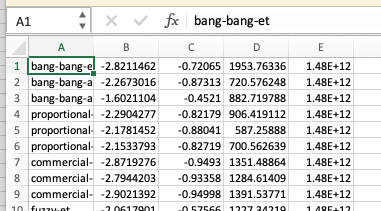

* Reproducing tables
** Key ideas

+ DON'T manually transfer table values to LaTeX -- DO put the data in a
  separate file that gets loaded during compilation.
+ DON'T format your values and truncate decimal places manually -- DO
  use a script to truncate values consistently.
+ DON'T manually insert units or convert exponents -- DO use ~siunitx~
  to format numbers and units.

** Introduction

Developing replicable research is a key element in producing robust
results and good science.

To achieve replicable research, we must be able to come back to our
source files in 6, 12, 24 months (or more!) and be able to re-run any
part of the analysis, reproduce any graph, check the values in the
tables, and generally ensure that your results were not a fluke. How
important replicability is to you will be discipline dependent but no
self-respecting researcher should be publishing a paper that cannot be
replicated.

One element of replicability is to produce tables in such a way that
manual error is avoided and that any value in the table can be
recalculated.

Manual handling of numbers is a common source of error but it needn't
be. Once scripts are set up to automatically generate tables from the
source data, they are easily modified to suit the next table, the next
paper, or the next project. If you are not using a tool that supports
you producing your tables directly, then this will be the biggest
first difficulty. However, without this step, it will be hard, not
just to automate your tables, but to produce replicable research /at
all/.

Two tools that I will discuss here for automating tables are Python
and R. Either one or both can be used but I also recommend tying
everything together with GNU Make so that it is easier to remember how
to run your scripts when you come back to them later.

** Background

+ A quick search for reproducibility in science on [[https://scholar.google.com/scholar?hl=en&as_sdt=0%2C5&q=reproducibility+in+science&btnG=&oq=reprod][Google Scholar]]
  yields top hits in the biomedical domain. 
+ It's not surprising that biomedical researchers consider
  reproducibility more than most other researchers since they are
  literally dealing with life or death decisions. 
+ Nevertheless, /all/ researchers should consider reproducibility
  important.
+ Research that is not reproducible may not be flawed but we will
  never really know.
+ It might be tempting to obscure the method detail. Publishers tend
  to encourage us to make the method section as terse as
  possible. However, disguising the method can also cover up dishonest
  practice.
+ Since new research always builds on past work, flawed science can
  hold back a domain and prevent progress.

+ [[https://scfbm.biomedcentral.com/articles/10.1186/1751-0473-8-7][Git can facilitate greater reproducibility and increased
  transparency in science]]. (This may not be so relevant?)

+ [[https://en.wikipedia.org/wiki/Open_science][The Open science movement]] is leading the way towards more
  transparent scientific practices. Research should be open for
  inspection and critique at every level. 

+ Karl Popper -- science is about [[https://en.wikipedia.org/wiki/Falsifiability][falsifiability]]. A /correctly
  phrased/ scientific hypothesis can be proven false with a single
  piece of evidence. Similarly, /any/ existing knowledge can
  potentially be overturned based on new evidence.
+ Research papers are, by and large, about clearly communicating
  scientific hypotheses and the associated evidence supporting those
  hypotheses.
+ Other researchers might try to test a hypothesis that they find in a
  research paper by either repeating the experiment or re-analysing
  the data. 
+ Since many public data-sets are now available, repeating analysis is
  both possible and worthwhile. 
+ Indeed, it makes sense for researchers to make their data-set and
  analysis methods available to others to allow them to check them
  much in the same way as open-source software makes it possible for a
  wider community to help with identifying security flaws.
+ If a work is not able to be reproduced because there is not enough
  information to redo the experiment then the work may still be valid
  but its validity is questionable. 

Scientific research can, at times, be dispiriting. 
Young researchers will often find themselves comparing their Google
Scholar profile with such greats as
[[https://scholar.google.com/citations?user=6m4wv6gAAAAJ&hl=en&oi=ao][Richard Sutton]] a
One is automatically 

** Loading table data from a file
#+CAPTION: Example results file to be converted into a table

Most researchers will manually transcribe this data into a LaTeX (or Word) document, like so:
#+BEGIN_SRC latex
\begin{tabular}{...}
Policy & Avg. Reward & Comfort score & Energy use (Wh)\\
bang-bang-et & $-2.82$ & $-0.72$ & $1950$ \\
bang-bang-avg & $-2.27$ & $-0.87$ & $721$ \\
...
#+END_SRC

Note how a few things needed to be manually transformed in this process.  

+ Numbers need to be written in math-mode (using ~$~ signs)
  to give a consistent font and to ensure that the minus signs look
  right.
+ Some rows or columns may not be relevant (the 1.48E+12 is actually
  to do with the Unix clock time when the result was generated).
+ The numbers need to be truncated or rounded appropriately. It's a
  good question to ask "what's appropriate?" here. If you have
  standard deviation or confidence intervals then round appropriately
  for that. Leaving in a large number of digits suggests that you
  don't understand the uncertainty in your data. 
+ Exponents need to be translated into a printable form. Note that the
  ~siunitx~ package has a nice facility for doing this
  automatically.

With so many little details to be taken care of, automating looks
hard. Fortunately, there are some cool tools to help. 

+ two options: use csvsimple to read in a CSV file
+ alternatively, use ~\input~ and write a tex file that contains the
  table rows using a script

*** Using csvsimple

insert minimal code here to do csvsimple with the table above.

+ how to avoid embedding the figures in the source text
+ formatting numbers so that they can be read
+ formatting according to significant digits
+ using a Makefile to help remember how to run your scripts

*** Generating latex directly
** Significant figures
*** Truncating numbers appropriately

Quoting table values to 10 decimal places is clearly not
appropriate. Most experiments, if tried again, will yield slightly
different values. We should aim to express numbers in a way that
appropriately reflects our uncertainty about the true value.

For example, imagine that we have an experiment that involves 10
trials and we record the mean measurement value from those trials. The
standard deviation provides useful information about the likely
precision of the mean. Confidence intervals can often be derived from
the standard deviation given the sample size and assuming a normal
distribution.

The standard deviation should be expressed to ONE [[https://en.wikipedia.org/wiki/Significant_figures][significant figure]]
unless the number is between 11 and 19 (times some power of ten) in
which case you can use two significant figures.

The measurement value should be expressed to agree in terms of decimal
places with the standard deviation.

For example, a value resulting from a spreadsheet calculation of an
average and standard deviation might be 10.1298 ± 0.2595. This should
be expressed as 10.1 ± 0.3 or 10.1 (0.3) where the number in
parenthesis is taken to be the estimated standard deviation. The
estimate indicates that the value is only known to within three tenths
of a unit of measurement. The figures beyond the tenths place, are not
significant.

Note that I'm glossing over the details here and it is worth reading
more about [[https://en.wikipedia.org/wiki/Measurement_uncertainty][measurement uncertainty]]. Consider the above a rule of
thumb.

*** Python code for truncation of means and standard deviations

The following code roughly obeys the above rules. The trick is to use
a nice feature of the python string formatter that allows the number
of digits after the decimal point to be parameterised.
#+BEGIN_SRC python
def mean_string(m, s):
    return '{:6.{sig}f} ± {:.1g}'.format(m, s, sig=-int(np.floor(np.log10(s))))
#+END_SRC

# example use
#+BEGIN_SRC 
>>> mean_string(0.016933, 0.005105)
' 0.017 ± 0.005'
#+END_SRC

The way this works is to work out the base 10 log of the s.d. This
number will typically be negative (I haven't dealt with s.d. >
1!). Taking the floor of this number will tell you how many digits
after the decimal point need to be included to format the mean.

For this simple code, the s.d. is simply formatted with 1 significant
figure. This might be improved by first finding out if the first two
digits of the s.d. are between 11 and 19 inclusive and in that case
formatting with 2 significant digits.

** Makefiles to tie together and document

I always find that when I come back to a project after leaving it for
a few weeks that I cannot remember what I've done. Some vague
recollection exists, perhaps, of scripts that process one file into
another but the details and ordering of the procedure have vanished
from my memory.

In theory, one might /document/ a process. However, this still leaves
a manual process that may get out of step with the last
version of the documentation. 

A better approach is to weave the documentation and the code together
into a master script. [[https://the-turing-way.netlify.app/reproducible-research/make][GNU Make]] provides a simple and effective method
for doing this. 

I should note that GNU Make simply does not handle
having spaces or special characters in filenames---don't even
try. However, it is usually not such a burden to use hypens or underscores.

GNU Make standardises the master script filename as ~Makefile~.

An excellent tutorial on using Make for replicable research is
provided by [[https://the-turing-way.netlify.app/reproducible-research/make][Arnold et al.]]

** Conclusions and next steps

I recently came across The Turing Way by Arnold et al., and I think
this perfectly exemplifies the approach, applying more generally to
the research process. 

[1] The Turing Way Community, Becky Arnold, Louise Bowler, Sarah
Gibson, Patricia Herterich, Rosie Higman, … Kirstie Whitaker. (2019,
March 25). The Turing Way: A Handbook for Reproducible Data Science
(Version v0.0.4). Zenodo. http://doi.org/10.5281/zenodo.3233986

